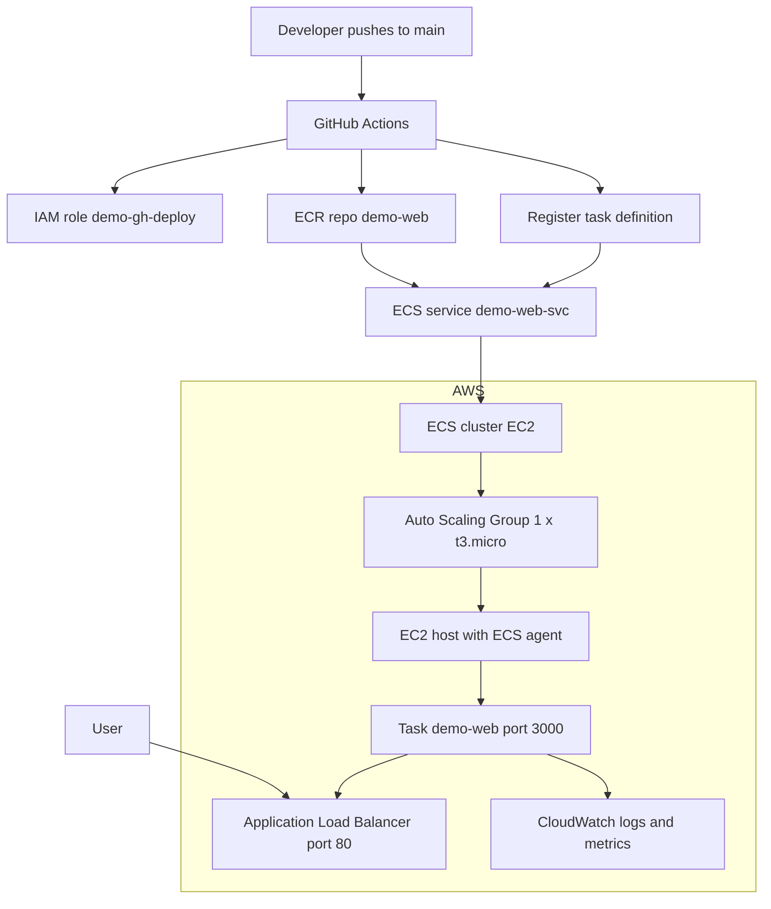

# container-platform-AWS

**Author:** Gabriel Ejiro  
**Project:** Production-style container platform on AWS using **ECS (EC2)**, **ALB**, **ECR**, **IAM OIDC (GitHub Actions)**, **CloudWatch**, and **Terraform** — tuned for **Free-Tier** use.

---

## What this does

- Runs a containerized web app on **Amazon ECS (EC2 launch type)** with an **ALB** in front.
- **CI/CD**: Push to `main` → GitHub Actions assumes an AWS role via **OIDC** → builds image → pushes to **ECR** → updates ECS service.
- **Observability**: App logs in **CloudWatch Logs**; ALB & ECS metrics in **CloudWatch Metrics**.
- **Security**: Least-privilege **task role** (IRSA-like) and a scoped **deploy role** for GitHub.

---

## 🧩 Architecture (Mermaid)

